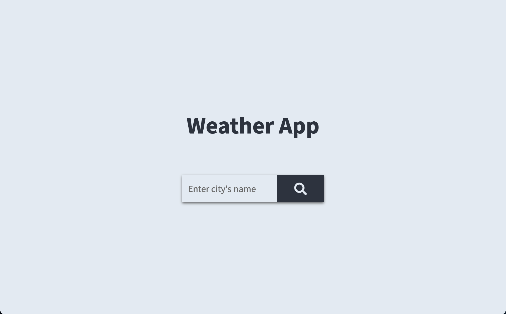
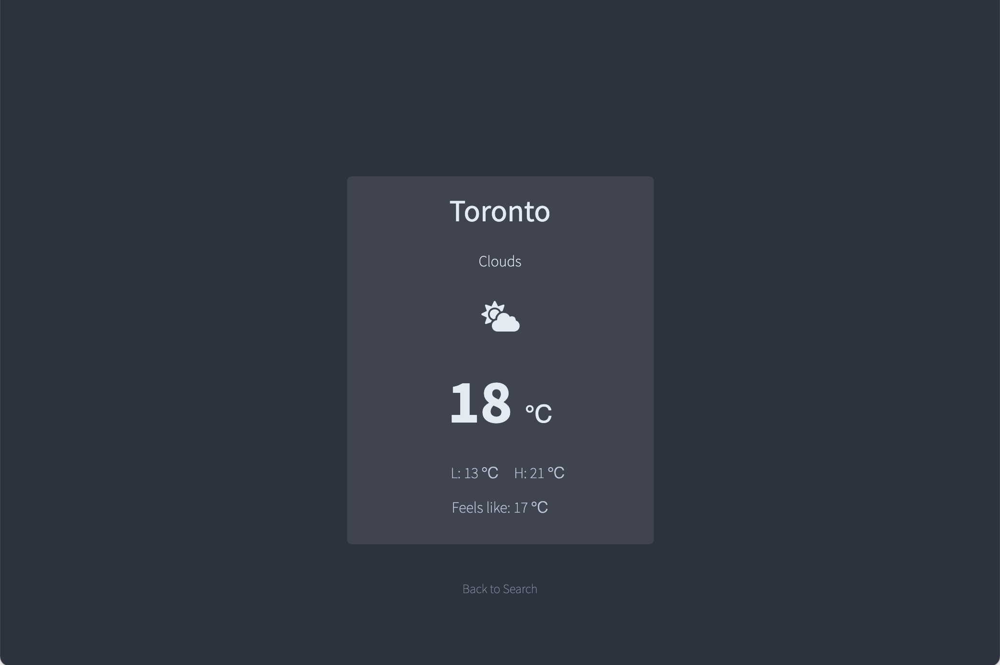

# React Weather App

<ul>
  <li> Built a responsive, single-page application from scratch in VS Code using ReactJS framework and CSS.</li>
   <li>Wrote the code for each component shown on the website by using functional components, React hooks and React states.</li>
   <li>Built a search bar with a submit button to allow users to search the weather information by city’s name.</li>
   <li>Get current weather data for any location from “openWeather” API by using the async/await fetch call.</li>
   <li>Displayed the current weather information, including the city's name, weather condition, weather icon, current temperature, the lowest and highest temperature, and the “feel like” temperature.</li>
   <li>Set up weather icons by using “font awesome icon”.</li>
   <li>Changed to a mobile design by checking the window size of the browser object model using React hooks.</li>
</ul>
